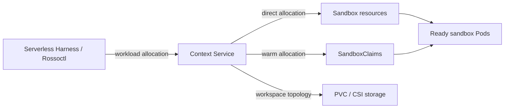
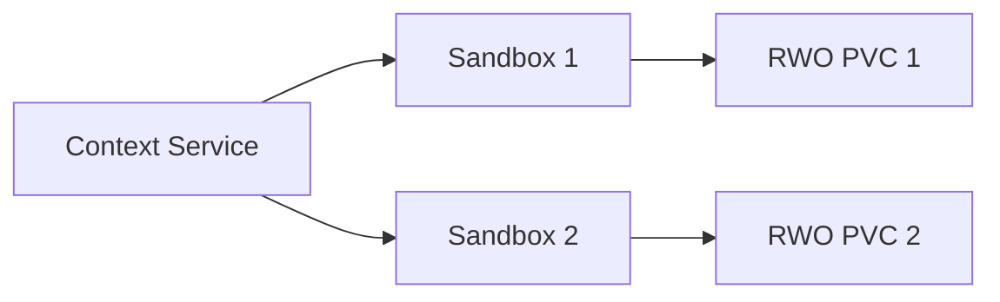
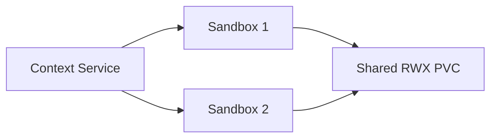
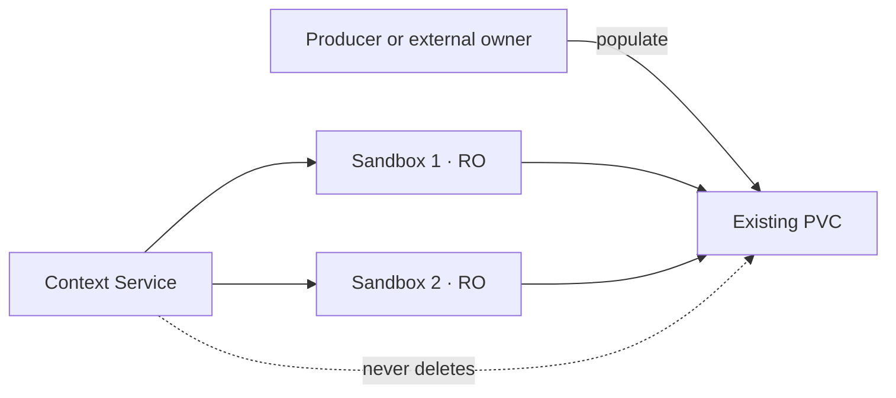
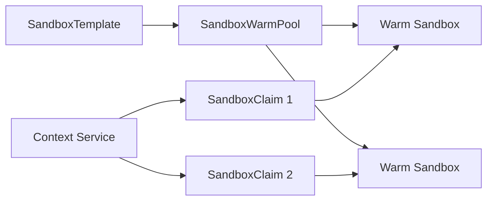

# Context Service

Context Service provides **Agent Context Infrastructure**: the storage, execution capacity, and
lifecycle needed to make durable context available to agents. Here, context means an agent's
workspaces, memory, knowledge, artifacts, and related runtime state—not an LLM's finite context
window.

A caller describes the number of sandboxes and workspace topology it needs; Context Service
creates or claims that capacity and returns a Kubernetes selector for routing work.



Serverless Harness is the first integration: it requests a pool at workload start, routes runs to
the returned selector, and releases the allocation afterward. Agents do not call Context Service
or create Kubernetes resources directly.

Context Service currently supports:

- Named PVC-backed `workspace`, `memory`, `knowledge`, and `artifacts` resources
- Dedicated RWO workspaces per sandbox
- One shared RWX workspace across a sandbox pool
- An existing PVC mounted explicitly read-only or read-write
- Claims against an existing agent-sandbox WarmPool

Read the long-term [vision](VISION.md), the [core design and workflows](docs/design.md), the
[Context Service API](docs/api.md), its [examples](docs/api-examples.md), the
[Serverless Harness integration](docs/serverless-harness.md), and the
[WarmPool claim design](docs/warm-pools.md).

Status: early prototype. The API is not stable.

## CLI

Build the small command-line client:

```sh
make build
```

Copy and edit the example configuration, then load it into your shell:

```sh
cp .env.example .env
# Edit .env and replace the token placeholder.
set -a
source .env
set +a
```

The local `.env` contains credentials and is ignored by Git. `.env.example` is safe to commit and documents every setting.

### Dedicated workspace per sandbox

Create one sandbox with its own 1Gi RWO workspace:



```sh
bin/contextctl create demo
bin/contextctl wait demo
bin/contextctl get demo
bin/contextctl rm demo
```

Use `-n` to create multiple sandboxes. Each sandbox receives a separate RWO PVC. Deleting the pool
also deletes its managed PVCs.

```sh
bin/contextctl create review -n 3
```

### Shared workspace

Create two sandboxes sharing one RWX workspace:



```sh
bin/contextctl create demo --shared
bin/contextctl wait demo
bin/contextctl get demo
bin/contextctl rm demo
```

Override the sandbox count, workspace size, or storage class as needed:

```sh
bin/contextctl create review --shared -n 3 -s 5Gi -c ibm-scale-csi
```

Deleting the pool also deletes its managed shared PVC.

### Existing workspace

Attach an existing populated PVC read-only to a sandbox pool:



```sh
bin/contextctl create readers --claim prepared-workspace --read-only -n 3
bin/contextctl wait readers
bin/contextctl rm readers
```

Attach it read-write instead:

```sh
bin/contextctl create writer --claim prepared-workspace --read-write
```

`--claim` requires exactly one of `--read-only` or `--read-write`. Deleting either pool removes its sandboxes but does not delete the externally owned PVC.

### WarmPool claims

Claim ready sandboxes from an existing agent-sandbox `SandboxWarmPool`:



```sh
bin/contextctl create fast-run --warm-pool research-agents -n 3
bin/contextctl wait fast-run
bin/contextctl rm fast-run
```

WarmPool claims use the image, environment, and storage already configured by the pool's
`SandboxTemplate`. Deleting the allocation removes its `SandboxClaim` resources; the upstream
controller manages the claimed Sandboxes and replenishes the WarmPool. `--warm-pool` cannot be
combined with Context Service workspace options.

Run `bin/contextctl help` or `bin/contextctl help create` for defaults, options, and examples.
