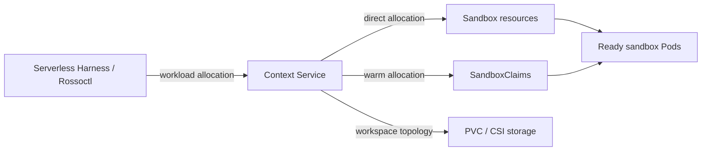

# Context Service

Context Service provides **Agent Context Infrastructure**: the storage, execution capacity, and
lifecycle needed to make durable context available to agents. Here, context means an agent's
workspaces, memory, knowledge, artifacts, and related runtime state—not an LLM's finite context
window.

A caller describes the number of sandboxes and workspace topology it needs; Context Service
creates or claims that capacity and returns a Kubernetes selector for routing work.



Serverless Harness is the first integration: it requests a pool at workload start, routes runs to
the returned selector, and releases the allocation afterward. Agents do not call Context Service
or create Kubernetes resources directly.

Context Service currently supports:

- Named PVC-backed `workspace`, `memory`, `knowledge`, and `artifacts` resources
- Dedicated RWO workspaces per sandbox
- One shared RWX workspace across a sandbox pool
- An existing PVC mounted explicitly read-only or read-write
- Platform-managed sandbox runtime profiles
- Claims against an existing agent-sandbox WarmPool

Status: early prototype. The API is not stable.

## Try it locally

With Docker, Kind, `kubectl`, `curl`, and Go installed:

```sh
make build
export PATH="$PWD/bin:$PATH"
make kind-up
export CS_STORAGE_CLASS=local-path

contextctl ctx create demo
contextctl sb create demo-pool
contextctl sb wait demo-pool
contextctl status
```

For a ready-made showcase with multiple context types, sandbox profiles, Pods, and PVCs:

```sh
make kind-demo
```

See the [complete getting-started guide](docs/getting-started.md) for cleanup, deployment,
configuration, sandbox profiles, and illustrated storage layouts.

## Documentation

- [Getting started](docs/getting-started.md)
- [Vision](VISION.md)
- [Design and workflows](docs/design.md)
- [API reference](docs/api.md) and [API examples](docs/api-examples.md)
- [Serverless Harness integration](docs/serverless-harness.md)
- [WarmPool integration](docs/warm-pools.md)
