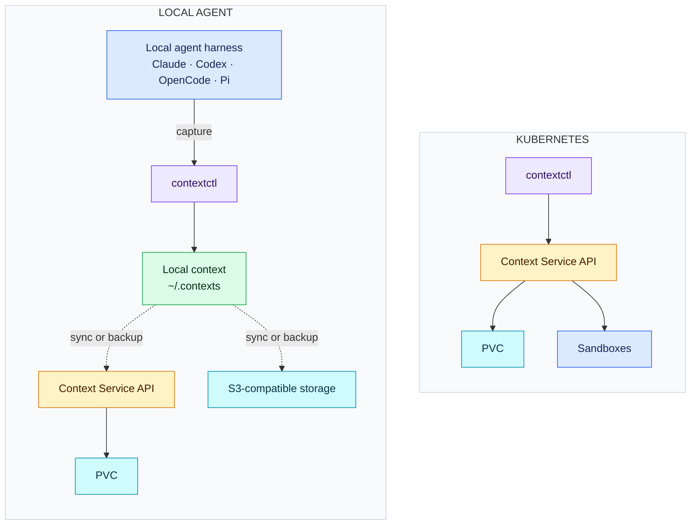

# Context Service

Context Service provides **Agent Context Infrastructure**: durable storage and lifecycle management
for the state, memory, knowledge, workspaces, and artifacts that agents create.

It works wherever the agent runs:

- **Local harnesses** — capture native state from Claude Code, Codex, OpenCode, or Pi without
  requiring Kubernetes or a running service.
- **Container-native platforms** — manage PVC-backed context, shared workspaces, sandboxes, and
  warm pools through a service API and any CSI storage provider, including IBM Storage Scale.

Both use the same context model, revisions, provenance, and portable transport.



## What it provides

- Automatic capture and restore of native agent-harness state
- On-demand sync and continuous backup between local context, PVCs, and S3
- Content-addressed revisions with checksums and provenance
- Snapshots, writable clones, safe restore, and retention
- Derived long-term memory, searchable knowledge, and immutable artifacts
- Shared or isolated sandbox workspaces, existing PVCs, and warm-pool allocation
- A concise graph of sources, derivatives, consumers, and storage copies

Status: early prototype. The API is not stable.

## Install

```sh
curl -fsSL https://raw.githubusercontent.com/rossoctl/context-service/main/install.sh | sh
```

## Capture & Sync

Capture a local Claude session—no service or Kubernetes required:

```sh
mkdir -p /tmp/context-demo && cd /tmp/context-demo
contextctl ctx create demo --type state --backend filesystem
contextctl ctx attach demo --harness claude
claude
```

Tell Claude `Remember that this project's codename is Juniper`, then exit. The session is captured
automatically.

With a remote Context Service configured, sync it to a PVC:

```sh
contextctl ctx create cloud-demo --type state
contextctl ctx sync push demo --remote-name cloud-demo
```

## Continuous Backup

Keep later sessions backed up automatically while you work:

```sh
contextctl ctx backup start demo --to pvc://serverless-harness/cloud-demo
claude --continue
contextctl ctx graph
```

See the [complete local-to-PVC demo](demos/local/local-to-pvc/) for pull, restore, and cleanup.

## Documentation

- [Capture local harness state](demos/local/harness-capture/)
- [Try Context Service on Kind](demos/kind/)
- [Context portability](docs/context-portability.md) and [automatic backup](docs/context-backup.md)
- [Context relationship graph](docs/context-graph.md)
- [Snapshots, clones, and retention](docs/context-lifecycle.md)
- [Memory and knowledge](docs/derived-memory.md) and [query API](docs/context-query.md)
- [Design and workflows](docs/design.md)
- [API reference](docs/api.md)
- [Serverless Harness integration](docs/serverless-harness.md)
- [Vision](VISION.md)
