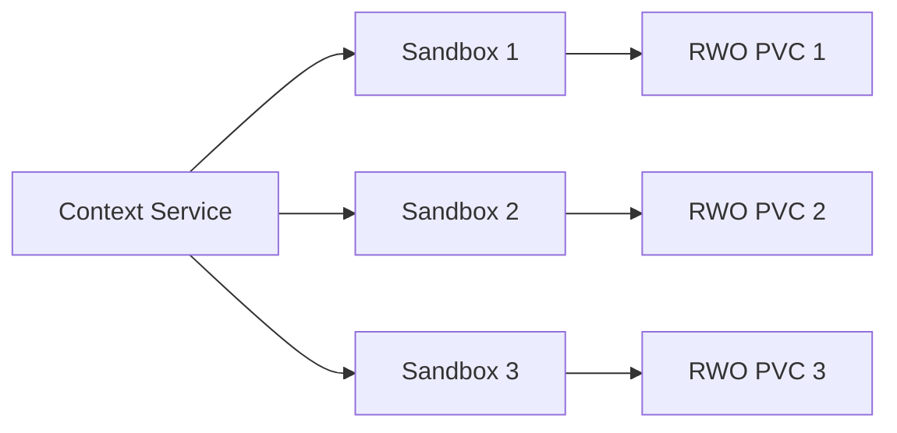
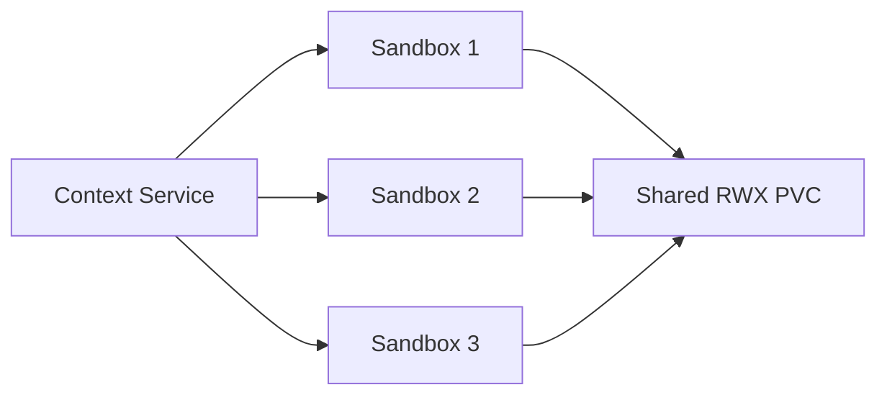

# API examples

These examples call Context Service directly. Agent workloads normally use a runtime integration
such as [Serverless Harness](serverless-harness.md).

```sh
export CS_URL=https://example.test/context-service
export CS_TOKEN=replace-with-gateway-token
```

The token shown here is enforced by an example ingress gateway, not Context Service; the service
itself does not implement authentication (see [API](api.md)). `contextctl` sends this token as
`X-SH-Auth`, matching a Serverless Harness-style gateway convention. Substitute whatever header
your own gateway expects.

## Health

```sh
curl --fail --silent --show-error \
  -H "X-SH-Auth: $CS_TOKEN" \
  "$CS_URL/healthz"
```

## Dedicated RWO workspaces

`ReadWriteOnce` creates one managed PVC per sandbox:



```sh
curl --fail --silent --show-error \
  -H "X-SH-Auth: $CS_TOKEN" \
  -H "Content-Type: application/json" \
  -X POST "$CS_URL/v1/sandbox-pools" \
  -d '{
    "name": "code-review",
    "replicas": 3,
    "workspace": {
      "size": "5Gi",
      "accessMode": "ReadWriteOnce",
      "storageClass": "ibm-scale-csi"
    }
  }'
```

## Shared RWX workspace

`ReadWriteMany` creates one managed PVC mounted by every sandbox:



```sh
curl --fail --silent --show-error \
  -H "X-SH-Auth: $CS_TOKEN" \
  -H "Content-Type: application/json" \
  -X POST "$CS_URL/v1/sandbox-pools" \
  -d '{
    "name": "shared-review",
    "replicas": 3,
    "workspace": {
      "size": "5Gi",
      "accessMode": "ReadWriteMany",
      "storageClass": "ibm-scale-csi"
    }
  }'
```

| `accessMode` | PVCs created | Topology |
|---|---:|---|
| `ReadWriteOnce` | One per replica | Dedicated workspace per sandbox |
| `ReadWriteMany` | One total | Shared workspace across all sandboxes |

## Existing PVC

An existing claim requires an explicit read policy. Multiple sandboxes require the PVC to support
`ReadWriteMany`.

```sh
curl --fail --silent --show-error \
  -H "X-SH-Auth: $CS_TOKEN" \
  -H "Content-Type: application/json" \
  -X POST "$CS_URL/v1/sandbox-pools" \
  -d '{
    "name": "readers",
    "replicas": 3,
    "workspace": {
      "claimName": "prepared-workspace",
      "readOnly": true
    }
  }'
```

Set `readOnly` to `false` for explicit read-write attachment. Context Service never deletes this
caller-owned PVC.

## Existing WarmPool

The `SandboxWarmPool` and SandboxTemplate must already exist. Context Service creates
SandboxClaims; compute and storage configuration come from the template.

```sh
curl --fail --silent --show-error \
  -H "X-SH-Auth: $CS_TOKEN" \
  -H "Content-Type: application/json" \
  -X POST "$CS_URL/v1/sandbox-pools" \
  -d '{
    "name": "fast-review",
    "replicas": 3,
    "warmPoolRef": "research-agents",
    "workspace": {}
  }'
```

`warmPoolRef` cannot be combined with workspace settings.

## List pools

```sh
curl --fail --silent --show-error \
  -H "X-SH-Auth: $CS_TOKEN" \
  "$CS_URL/v1/sandbox-pools"
```

## Read status

```sh
curl --fail --silent --show-error \
  -H "X-SH-Auth: $CS_TOKEN" \
  "$CS_URL/v1/sandbox-pools/shared-review"
```

## Release

```sh
curl --fail --silent --show-error \
  -H "X-SH-Auth: $CS_TOKEN" \
  -X DELETE "$CS_URL/v1/sandbox-pools/shared-review"
```
