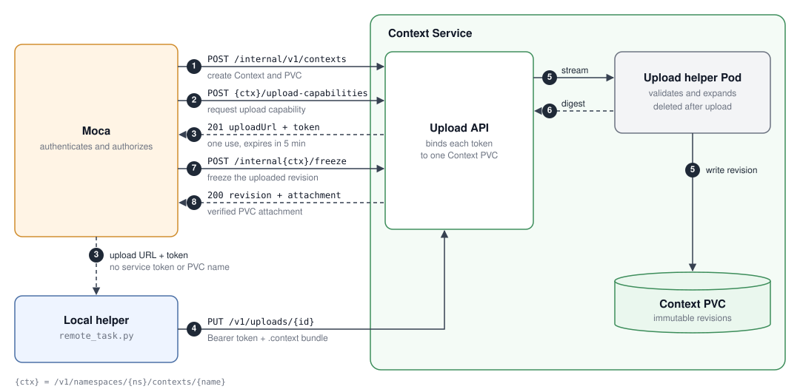

# How context uploads work

Moca authorizes the user and manages the workload. The client uploads context bytes directly to
Context Service. Context Service validates the bundle and stores one content-addressed revision in the
Context PVC. Context Service does not create Sandboxes in this flow.

## Upload flow

1. Moca creates a Context for the authenticated user.
2. Moca requests an upload capability for that Context.
3. Context Service returns a single-success `PUT` URL and token. They expire after five minutes.
4. The local helper uploads the compressed `.context` bundle directly to Context Service.
5. A temporary helper Pod validates and materializes the bundle in the Context PVC.
   - It verifies the archive structure, context type, paths, checksums, and size limits.
   - It rejects symbolic links, duplicate entries, and unsafe paths.
   - It extracts the files into `.context-service/materialized/<revision>`.
   - It sets directories to `0755` and regular files to `0644`.
   - It returns the revision digest, workspace path, file count, and byte count.
6. Context Service deletes the helper Pod and publishes the content digest.
7. Moca freezes that exact revision before it creates any Sandbox.
8. Context Service returns the verified PVC attachment to Moca.

Moca then mounts only the frozen revision when it creates the Sandbox.

## Safety boundaries

- Moca sends its service token and the authenticated user identity to trusted Context Service routes.
- The client receives an upload capability, but it does not receive the service token or PVC name.
- A capability is bound to one Context and its immutable PVC identity.
- A failed upload can retry with the same capability until it expires. A successful upload consumes it.
- Grant revocation does not cancel an issued capability. Its access expires within five minutes.
- Context Service serializes uploads to each PVC and rejects uploads after a revision is frozen.
- The compressed bundle limit is 256 MiB. Expanded content cannot exceed 1 GiB or 90% of the PVC.
- Context Service rejects unsafe paths, symbolic links, type mismatches, and checksum mismatches.
- Materialized directories use `0755`. Materialized files use `0644`.
- Upload capabilities are stored in memory, so this prototype requires one Context Service replica.
