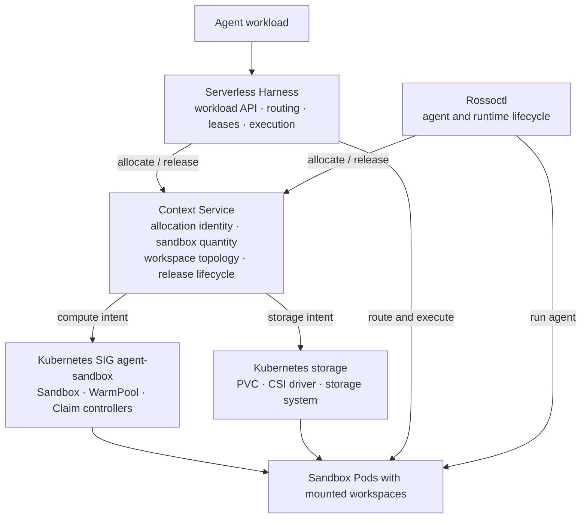
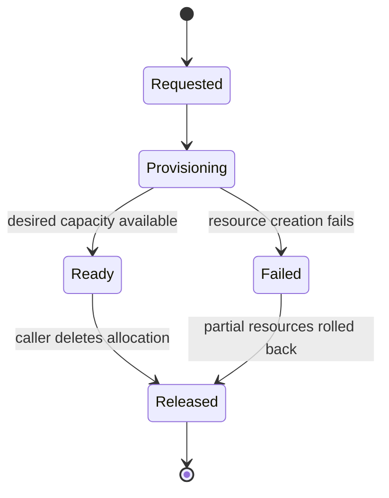
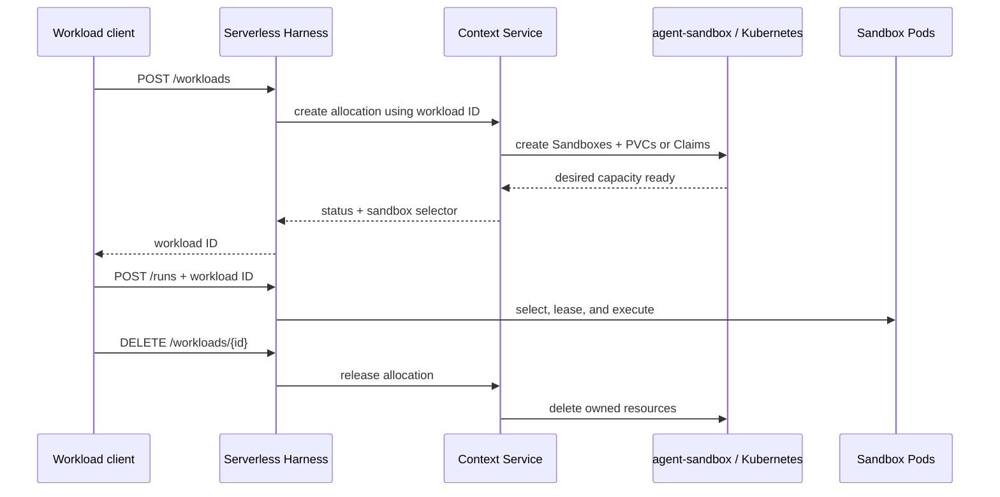

# Context Service design

## Objective

Context Service allocates the sandbox capacity and durable workspace required by an agent
workload. The caller describes intent—how many sandboxes it needs and how their workspace should
behave—and receives a stable Kubernetes selector for routing work.

This replaces install-time sandbox topology with workload-time allocation. A cluster can support
different workloads without predeclaring every combination of sandbox count, shared storage, and
dedicated storage.

## Why this is a service

Kubernetes and agent-sandbox expose useful infrastructure primitives, but neither represents the
complete allocation needed by an agent workload:

- A `Sandbox` defines one execution environment.
- A `SandboxWarmPool` maintains ready execution capacity.
- A PVC provides durable filesystem state.
- A CSI driver provisions and attaches the underlying storage.

A workload normally needs a coordinated combination of these resources. Context Service provides
that workload-level contract while keeping Kubernetes details out of Serverless Harness,
Rossoctl, and agent code.

Context Service is useful only while it preserves this higher-level boundary. It should not become
a one-to-one REST wrapper around every agent-sandbox field.

## System boundary



Ownership is deliberately split:

| Layer | Responsibility |
|---|---|
| Context Service | Workload-scoped allocation, workspace topology, selector, and release |
| agent-sandbox | Sandbox-to-Pod lifecycle and WarmPool reconciliation |
| Kubernetes and CSI | PVC provisioning, attachment, and mount enforcement |
| Serverless Harness | Workload-facing API, Redis leases, sandbox selection, and execution |
| Rossoctl | Long-running agent and runtime lifecycle |
| Agent workload | Declares requirements and performs work; does not create infrastructure |

## Allocation contract

Every allocation has:

- A caller-supplied name that also serves as the workload identity.
- A requested sandbox count.
- Exactly one allocation strategy.
- A selector applied to the resulting Sandbox Pods.
- A lifecycle ending when the caller releases the allocation.

The response reports provisioning status, desired and ready capacity, and the selector. Callers
wait for `ready` before dispatching work.



## Allocation strategies

### Dedicated managed workspaces

Context Service creates one direct Sandbox and one RWO PVC per replica. This isolates filesystem
state and allows the scheduler to place each sandbox independently.

```text
workload
  +-- Sandbox 0 --> RWO PVC 0
  +-- Sandbox 1 --> RWO PVC 1
  +-- Sandbox N --> RWO PVC N
```

The PVCs belong to the allocation and are deleted when it is released.

### Shared managed workspace

Context Service creates one RWX PVC and mounts it into every direct Sandbox. This avoids duplicate
copies of repositories or artifacts and allows agents on different nodes to operate on the same
filesystem.

```text
Sandbox 0 --+
Sandbox 1 --+--> shared RWX PVC
Sandbox N --+
```

The shared PVC belongs to the allocation and is deleted when it is released.

### Existing workspace

The caller supplies an existing PVC and explicitly requests a read-only or read-write mount.
Context Service creates direct Sandboxes around that storage but never assumes ownership of it.

This supports producer/consumer workflows: one allocation can populate durable artifacts and a
later allocation can consume the same artifacts read-only. The Mosaic demo validates this model.

Read-only is enforced at the Pod mount. It is not a new PVC access mode, and releasing the
allocation never deletes the external claim.

### Existing WarmPool

The caller supplies `warmPoolRef` instead of workspace settings. Context Service creates one
SandboxClaim per replica and propagates the workload selector to the claimed Pods.

The upstream controller owns the claimed Sandbox and replenishes the WarmPool. Context Service
owns only the Claims created for the allocation. Details and limitations are in
[warm-pools.md](warm-pools.md).

| Strategy | Compute resource | Storage source | Released by Context Service |
|---|---|---|---|
| Dedicated | Direct Sandboxes | One managed RWO PVC per Sandbox | Sandboxes and PVCs |
| Shared | Direct Sandboxes | One managed RWX PVC | Sandboxes and PVC |
| Existing workspace | Direct Sandboxes | Caller-owned PVC | Sandboxes only |
| WarmPool | SandboxClaims | SandboxTemplate | Claims only |

## Serverless Harness workflow

Serverless Harness hides allocation mechanics from an agent workload:



The workload ID binds the SH lifecycle to the Context Service allocation. SH continues to own
backpressure, Redis leases, and `SandboxTransport`; Context Service does not route individual run
requests.

## Rossoctl integration direction

Rossoctl and SH have different execution models but can share the allocation contract:

- SH rapidly dispatches many runs across workload-scoped sandbox capacity.
- Rossoctl manages longer-lived agents and their runtime objects.
- Both may need durable storage that survives an individual process or agent session.

For a direct Rossoctl runtime, Context Service may provision or attach workspace storage while
Rossoctl owns the agent Pod or StatefulSet. For an agent-sandbox runtime, Rossoctl may use the same
direct Sandbox or WarmPool Claim allocation strategies as SH. This integration is a design
direction, not implemented behavior.

## Design invariants

- Workspace topology is declared before a Sandbox Pod is created or claimed. Kubernetes cannot
  add a PVC to an existing Pod.
- A managed PVC follows the allocation lifecycle; an external PVC never does.
- WarmPool mode uses the Template's image, environment, and storage configuration.
- Every resulting Pod carries the allocation selector used by the caller.
- Releasing one allocation must not delete another allocation's resources.
- Agent code remains unaware of Kubernetes resources and Context Service credentials.

## Current scope

The implemented scope is intentionally narrow:

- Allocate and release direct Sandbox pools.
- Create shared RWX or dedicated RWO managed workspaces.
- Attach an existing PVC read-only or read-write.
- Claim ready capacity from an existing WarmPool.

Context Service does not yet create SandboxTemplates or SandboxWarmPools. Session history,
semantic memory, knowledge synthesis, snapshots, and retention policy also remain outside the
current implementation.
