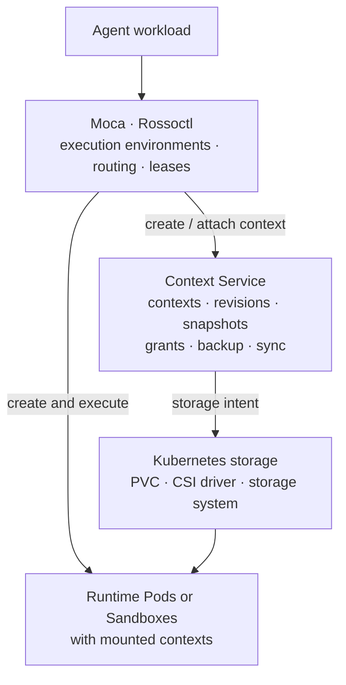

# Context Service design

Context Service is the component that provides **Agent Context Infrastructure**. It stores and
governs the workspaces, state, memory, knowledge, and artifacts used by agents. It is distinct from
the finite context window sent to an LLM.

## Objective

Context Service owns durable agent context: named contexts backed by PVCs, revisions, snapshots,
clones, grants, backup, and sync. A caller describes the context it needs and receives a stable
storage attachment that a runtime can mount.

Context Service does not create execution environments. Moca, Rossoctl, or
another runtime creates and selects the Pods or Sandboxes that run agents, and mounts the context
attachment into them.

## System boundary

```mermaid
flowchart TB
    Workload["Agent workload"]
    Runtime["Moca · Rossoctl<br/>execution environments · routing · leases"]
    CS["Context Service<br/>contexts · revisions · snapshots<br/>grants · backup · sync"]
    Storage["Kubernetes storage<br/>PVC · CSI driver · storage system"]
    Pods["Runtime Pods or Sandboxes<br/>with mounted contexts"]

    Workload --> Runtime
    Runtime -->|create / attach context| CS
    CS -->|storage intent| Storage
    Runtime -->|create and execute| Pods
    Storage --> Pods
```

| Layer | Responsibility |
|---|---|
| Context Service | Context identity, PVC lifecycle, revisions, snapshots, clones, access, backup, and sync |
| Kubernetes and CSI | PVC provisioning, attachment, and mount enforcement |
| Moca, Rossoctl, or another runtime | Execution environments (sandboxes), routing, leases, and execution |
| Agent workload | Declares requirements and performs work; does not create infrastructure |

## Design invariants

- A context's storage outlives any execution environment that mounts it.
- Context Service never deletes a context that has declared or active consumers unless forced.
- Read-only is enforced at the consumer's Pod mount; it is not a new PVC access mode.
- Agent code remains unaware of Kubernetes resources and Context Service credentials.

## History

Earlier versions also allocated execution capacity through `/v1/sandbox-pools`: direct
`agents.x-k8s.io` Sandboxes, sandbox profiles, and WarmPool claims. That API was removed once Moca
created its own execution environments. See [Removed: sandbox pools](api.md#removed-sandbox-pools).
