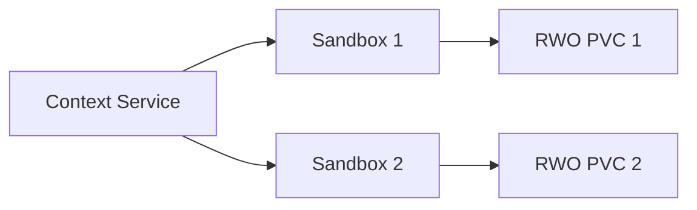
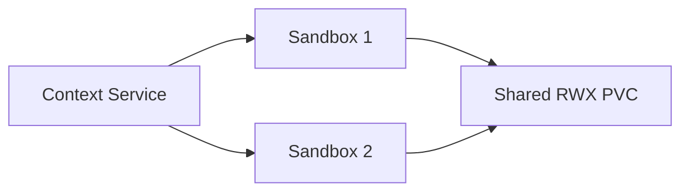
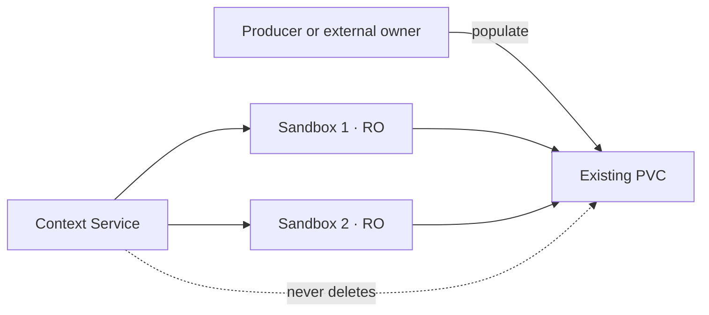
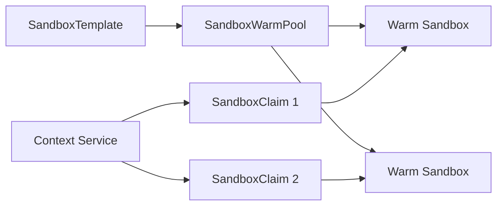

# Getting started

This guide covers local setup, the example demo, sandbox profiles, and workspace layouts.

## Guided Kind quickstart

Install Docker, Kind, `kubectl`, `curl`, and Go first.

### Build `contextctl`

```sh
make build
export PATH="$PWD/bin:$PATH"
```

### Start Context Service

```sh
make kind-up
export CS_STORAGE_CLASS=local-path

contextctl sc list
```

### Create a context

```sh
contextctl ctx create demo
contextctl ctx list
```

A new context may show `provisioning` until a workload mounts it.

### Create a sandbox pool

```sh
contextctl sb create demo-pool
contextctl sb wait demo-pool
contextctl sb list
```

### See what was created

```sh
contextctl status

# Refresh continuously
watch contextctl status
```

### Clean up

```sh
contextctl sb delete demo-pool
contextctl ctx delete demo
make kind-down
```

Context Service runs at `http://127.0.0.1:8080`. Run `make kind-smoke` to test both lifecycles
automatically.

## Ready-made demo

Create several ready-to-explore examples and display them together:

```sh
make kind-demo
export PATH="$PWD/bin:$PATH"
contextctl status
```

The demo includes:

- `demo-workspace`, `demo-memory`, and `demo-artifacts` contexts mounted by a sample agent
- `demo-dedicated`, with two profiled sandboxes and a workspace for each
- `demo-shared`, with two profiled sandboxes attached to one shared workspace
- `demo-readonly`, with two profiled sandboxes mounting prepared context read-only

The shared example uses a demo-only host-path RWX volume because Kind's default `local-path`
provisioner supports only RWO. Production environments should use an RWX-capable CSI driver.

```sh
make kind-demo-clean
make kind-down
```

## Deploy to Kubernetes

```sh
kubectl apply -f deploy/context-service.yaml
kubectl -n serverless-harness rollout status deployment/context-service
```

Before production, update the namespace, Context Service image, and `CS_SANDBOX_IMAGE` in
[`deploy/context-service.yaml`](../deploy/context-service.yaml).

If OpenShift `restricted-v2` rejects UID `65532`, remove `runAsUser` and `runAsGroup` from the
Deployment so OpenShift can assign them.

## CLI

The resource aliases `ctx`, `sb`, and `sc` are available for interactive use. For example,
`contextctl sb list` is equivalent to `contextctl sandbox-pool list`.

Copy and edit the example configuration, then load it into your shell:

```sh
cp .env.example .env
# Edit .env and replace the token placeholder.
set -a
source .env
set +a
```

The local `.env` contains credentials and is ignored by Git. `.env.example` is safe to commit.

## Sandbox profiles

A sandbox profile is a platform-managed `SandboxTemplate` that defines how sandbox Pods run:
their image, command, environment, resources, and security settings. Context Service adds the
requested workspace at `/workspace`.

```sh
kubectl apply -f deploy/examples/sandbox-profile.yaml
contextctl sb create developer --sandbox-profile shell
```

Omit `--sandbox-profile` to use the built-in runtime configured by `CS_SANDBOX_IMAGE`. Profiles
must leave persistent storage and the `workspace` volume name to Context Service. A WarmPool
already selects its own `SandboxTemplate`, so `--sandbox-profile` and `--warm-pool` cannot be
combined. Profiles require the optional agent-sandbox extensions API; `make kind-demo` installs
it automatically.

## Sandbox-pool workspace layouts

### Dedicated workspace per sandbox

Each sandbox receives its own RWO PVC:



```sh
contextctl sb create review --replicas 3
contextctl sb wait review
```

Deleting the pool also deletes its managed PVCs.

### Shared workspace

Multiple sandboxes can share one RWX PVC when the storage class supports `ReadWriteMany`:



```sh
contextctl sb create review --shared --replicas 3 \
  --workspace-size 5Gi --storage-class ibm-scale-csi
contextctl sb wait review
```

Deleting the pool also deletes its managed shared PVC.

### Existing workspace

Attach an existing populated PVC read-only:



```sh
contextctl sb create readers --claim prepared-workspace --read-only --replicas 3
contextctl sb wait readers
```

Attach it read-write instead:

```sh
contextctl sb create writer --claim prepared-workspace --read-write
```

`--claim` requires exactly one of `--read-only` or `--read-write`. Multiple sandboxes require an
RWX claim. Context Service never deletes the externally owned PVC.

### WarmPool claims

Claim ready sandboxes from an existing agent-sandbox `SandboxWarmPool`:



```sh
contextctl sb create fast-run --warm-pool research-agents --replicas 3
contextctl sb wait fast-run
```

The WarmPool's `SandboxTemplate` supplies its runtime and storage configuration. Deleting the
allocation removes its `SandboxClaim` resources, not the WarmPool or template.

Run `contextctl help` or `contextctl help sandbox-pool create` for all options and examples.
