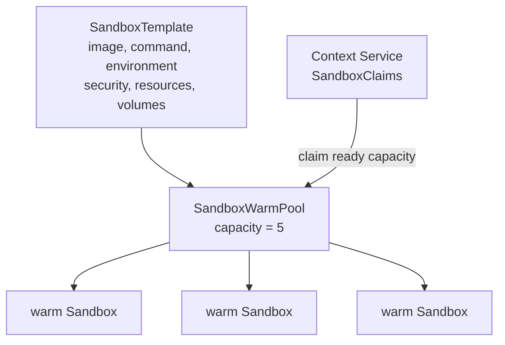

# WarmPool claims

## Purpose

Kubernetes SIG agent-sandbox WarmPools reduce sandbox startup latency by maintaining ready,
unclaimed Sandbox Pods. Context Service can allocate this existing capacity for a workload by
creating SandboxClaims instead of creating new Sandbox resources directly.



SandboxTemplate, SandboxWarmPool, and SandboxClaim are official, opt-in agent-sandbox extensions.
They must be installed separately from a core-only agent-sandbox deployment.

## Context Service behavior

Given an existing WarmPool, Context Service:

1. Verifies the referenced SandboxWarmPool exists.
2. Creates one SandboxClaim per requested replica.
3. Adds the workload label to each claimed Pod.
4. Reports readiness from SandboxClaim status.
5. Returns the normal sandbox selector.
6. Deletes the Claims when the allocation is released.

Context Service does not create or modify SandboxTemplates or SandboxWarmPools. Those remain
platform configuration.

## API and CLI

```json
{
  "name": "fast-run",
  "replicas": 3,
  "warmPoolRef": "research-agents",
  "workspace": {}
}
```

```sh
contextctl create fast-run --warm-pool research-agents -n 3
contextctl wait fast-run
contextctl get fast-run
contextctl rm fast-run
```

`warmPoolRef` cannot be combined with Context Service workspace settings.

## Compute versus data

WarmPools prewarm compute, not workspace contents. The Template defines the image, environment,
and volumes available to warm Sandboxes.

The upstream v1beta1 SandboxClaim API permits claim-time environment variables and
`volumeClaimTemplates`, but either option forces a cold start. The Context Service claim-only path
therefore uses the configuration already present in the WarmPool's SandboxTemplate.

Data can still be prepared by baking it into the image, initializing it when warm Sandboxes are
created, or mounting storage already defined by the Template. Context Service's direct allocation
modes remain appropriate when a workload needs a dynamically selected PVC topology.

## Testing status

Internal tests create WarmPool and SandboxClaim custom resources with the Kubernetes fake dynamic
client. They verify API validation, generated Claim manifests, readiness, deletion, and CLI
serialization. The extensions are not installed in the current development cluster, so this path
has not yet received a live-cluster smoke test.

## Upstream references

- [Kubernetes SIG agent-sandbox](https://github.com/kubernetes-sigs/agent-sandbox)
- [agent-sandbox extensions](https://github.com/kubernetes-sigs/agent-sandbox/tree/main/extensions)
- [agent-sandbox releases](https://github.com/kubernetes-sigs/agent-sandbox/releases)
